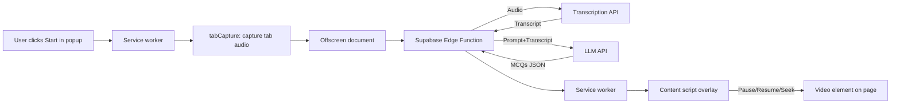
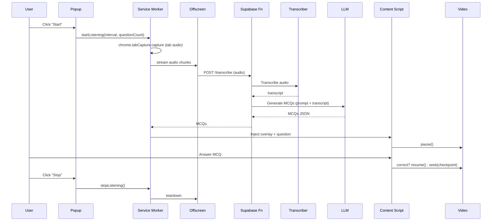

# LaserFocus — Chrome Extension

Turn any video into active learning. LaserFocus captures **tab audio** (not mic), transcribes it, and periodically pauses playback to ask **quick MCQs** so you stay engaged.

> **Free tier:** 100 minutes & 40 questions per month.

## Overview
- Works on YouTube, Udemy, Udacity, Coursera, SANS, LinkedIn Learning, and most HTML5 players
- Randomized answer options
- Checkpoint resume (on wrong answer, jump back and rewatch)
- Background-safe (keeps running if the popup closes)
- Privacy-first: tab audio only, no mic, no selling data

---

## Architecture (high level)

### Event flow (sequence)

---

## Data & Privacy (short)
- **Collected:** tab audio from the active tab (after user click), and minimal **usage counters** (minutes/questions) to enforce the free tier.
- **Processors:** **Transcriber API** (transcription), **LLM API** (MCQ generation).
- **Not stored:** LaserFocus does **not** store audio/transcripts after processing.
- **Not collected:** personal info, passwords, browsing history, keystrokes, microphone audio.
- **Security:** All traffic over HTTPS; least-privilege permissions.

**Privacy Policy:** See [`privacy.html`](./docs/privacy.html) (publicly served via GitHub Pages).

---

## Permissions (why we need them)
- `tabCapture` — capture **tab audio only** after user action
- `activeTab`, `scripting` — inject overlay UI, pause/resume/seek video on the current page
- `offscreen` — keep transcription working if the popup closes
- `storage` — remember user settings & quota counters
- `tabs`/`notifications`/`alarms` — timing & active tab control (if enabled)

---

## Screenshots
> See the Chrome Web Store listing for the latest screenshots.

---

## Contact
Questions or feedback: **ashispnayak@gmail.com.com**
